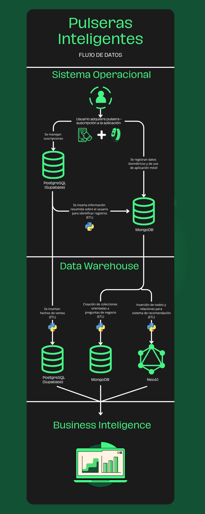

# Trabajo Práctico Final - Base de datos (Licenciatura en Ciencia de Datos)

**Participantes del proyecto:**

* Gerardo Toboso - getobosobarrios@estudiantes.unsam.edu.ar
* Gianni Bevilacqua - gbevilacqua@estudiantes.unsam.edu.ar
* Javier Spina - jaspina@estudiantes.unsam.edu.ar
* Bautista Turri - Turribautista551@gmail.com

Este proyecto corresponde al trabajo práctico final de la materia **Base de Datos** de la Lienciatura en Ciencia de Datos (1er cuatrimestre 2025). Tiene como objetivo la implementación de un sistema analítico realista utilizando un enfoque **políglota**, combinando al menos **un motor SQL** y **un motor NoSQL**. La consigna propone el diseño de una arquitectura de inteligencia de negocios (BI), incluyendo un Data Warehouse y la construcción de dashboards para realizar análisis de datos. El trabajo integra procesos ETL, modelado dimensional de tablas, y técnicas de minería de datos, simulando un caso empresarial completo.

## 🧠 Nuestro caso de negocio

Una compañía tecnológica está desarrollando una plataforma integral basada en **dispositivos portátiles inteligentes**. Estas pulseras monitorean continuamente diversos **parámetros biométricos** relacionados con la salud y la actividad física de los usuarios.  
Los dispositivos capturan datos como:  
- **Frecuencia cardíaca**
- **Calidad del sueño**
- **Niveles de actividad**, entre otros.

Además, se integran con una **aplicación móvil** que permite a los usuarios:
- Interactuar y visualizar información
- Recibir recomendaciones personalizadas
- Gestionar sus suscripciones

Nosotros, como equipo, estamos encargados del **área de datos** del proyecto. Nuestra metodología de trabajo está basada en **Scrum** (metodología ágil), lo que nos permite iterar sobre la implementación en ciclos de tiempo determinados.  

En una primera instancia, planeamos llegar a una versión **MVP** (*minimum viable product: mínimo producto viable*) para que la empresa pueda:
- Analizar resultados
- Tomar decisiones informadas sobre el futuro del producto
- Ajustar aspectos clave del sistema y de los datos a consumir por las diferentes áreas

El principal desafío es el **diseño y desarrollo de una infraestructura de datos robusta y escalable**, que pueda integrar y soportar múltiples fuentes de información:
- **Sistema transaccional** que gestiona suscripciones, pagos y perfiles de usuarios
- **Flujo constante y masivo (en streaming)** de los datos biométricos generados por las pulseras
- **Información de interacción** de los usuarios con la aplicación móvil (eventos de navegación, uso de funcionalidades, comportamiento en la plataforma)


## 🧾 Requerimientos clave

La solución que requiere la empresa implica **unificar y consolidar toda la información** detallada anteriormente en un **Data Warehouse** que funcione como el núcleo central de análisis de datos.  
Esto permite a la empresa:
- Obtener **métricas clave** y **parámetros de desempeño** del negocio (por ejemplo, tendencias de suscripción)
- Acceder a **patrones de uso** de las pulseras y la aplicación
- Consultar **indicadores de salud agregados** (tanto la empresa como los usuarios)

Con esta implementación, se contará con un **modelo de datos integrado** que facilitará:
- La generación de **predicciones** y **modelos analíticos avanzados**
- La **optimización de la experiencia del usuario**
- La **mejora de la retención**
- La **detección de patrones de salud relevantes**
- El **respaldo a la toma de decisiones estratégicas** a nivel comercial y operativo

De esta forma, se establece una **infraestructura capaz de soportar tanto análisis históricos como actuales**, y la construcción de **reportes y dashboards** que reflejen el estado y evolución del negocio y la salud de sus usuarios.

## 🧱 Flujo de datos del Sistema



El flujo de datos de la aplicación está organizado en tres subsistemas principales: **Sistema Operacional**, **Data Warehouse** y **Capa de Business Inteligence**. Cada uno de estos módulos cumple una función específica dentro del ecosistema de datos, y están conectados mediante procesos ETL desarrollados en Python.

1. **Sistema operacional**
   Este componente gestiona toda la información operativa relacionada a transacciones comerciales y datos brutos de aplicación móvil y sensor de la pulsera. Se encuentra conformado por dos bases de datos:

   * **Una PostgreSQL (a través de Supabase)** que registra datos de **usuarios**, **suscripciones**, **pagos** y **estados asociados**.
   * **Y otra MongoDB** que registra los datos enviados por los **sensores de la pulsera** y la **aplicación móvil**. Aquí se registran tanto 
   las métricas biométricas recolectadas por las pulseras como las interacciones con la aplicación por parte de los usuarios (como tiempo de pantalla o uso de funciones).

2. **Data Warehouse**
   Los datos operacionales son procesados mediante un flujo ETL y consolidados en un **Data Warehouse**. El objetivo 
   del mismo es guardar toda la información histórica del negocio para luego poder ser explotada por analistas y así mejorar continuamente el producto. El mismo se encuentra alojado en una base de datos **PostgreSQL (a través de Supabase)** la cual registra dos tipos de hechos de especial interés para la compañia:

   * **Hechos asociados a ventas/suscripciones del producto**.
   * **Hechos asociados a usabilidad del producto**, esto hace referencia a uso de la aplicación por parte de los usuarios y el uso de la pulsera por igual.

3. **Capa de Business Inteligence**
   Una vez que los datos están consolidados en el **Data Warehouse** estos están listos para ser analizados y así obtener insights valiosos sobre el producto 
   en general. Entre los puntos clave del negocio que esta capa busca cubrir están:

   * Análisis de ventas del producto y suscripciones a lo largo del tiempo por parte de usuarios.
   * Análisis de usabilidad de la pulsera y aplicación móvil en tiempo real.


## 📂 Estructura del Proyecto

```bash
pulseras_inteligentes/
├── sistema_operacional/           # Sistema operacional (datos transaccionales)
│   ├── ingesta_sensor_mongo/      # Scripts para ingesta de datos de sensores y aplicación móvil en MongoDB
│   └── transacciones_postgres/    # Scripts para gestión de transacciones comerciales en PostgreSQL
│
├── datawarehouse/                 # Data Warehouse (Hechos de ventas y usabilidad)
│
├── business_inteligence/          # Capa de Business Intelligence
│   ├── dashboards/                # Dashboards de Power BI
│   └── funcionalidades/           # Funciones desarrolladas en PostgreSQL para el análisis de datos
│
├── utils/                         # Utilidades compartidas
│   ├── conexiones_db.py           # Funciones de conexión a bases de datos
│   └── etl_funcs.py               # Funciones comunes para procesos ETL
```

## ⚙️ Tecnologías Utilizadas

* [**PostgreSQL (via Supabase)**](https://supabase.com/) 
* [**MongoDB**](https://www.mongodb.com/) 
* [**Python (ETL y Simulación)** ](https://www.python.org/)
* [**Power BI** ](https://www.microsoft.com/es-es/power-platform/products/power-bi)

## ⚙️ Cómo clonar y correr este proyecto

### 1. Clonar el repositorio

```bash
git clone https://github.com/Gerardo1909/tp_final_pulseras_inteligentes.git
cd tp_final_pulseras_inteligentes
```

### 2. Crear y activar un entorno virtual

```bash
python -m venv venv
source venv/bin/activate      # En Linux/macOS
venv\Scripts\activate.bat     # En Windows
```

### 3. Instalar las dependencias

```bash
pip install -r requirements.txt
```

### 4. Instalar el proyecto en modo editable
Esto permite importar los módulos de `utils` desde cualquier notebook sin problemas:

```bash
pip install -e .
```


